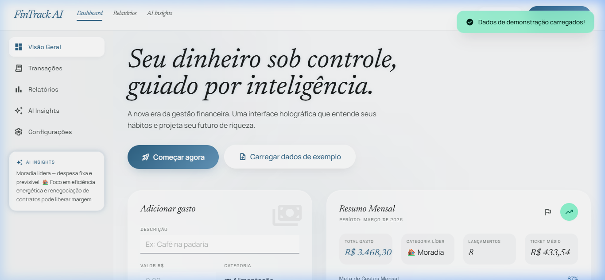
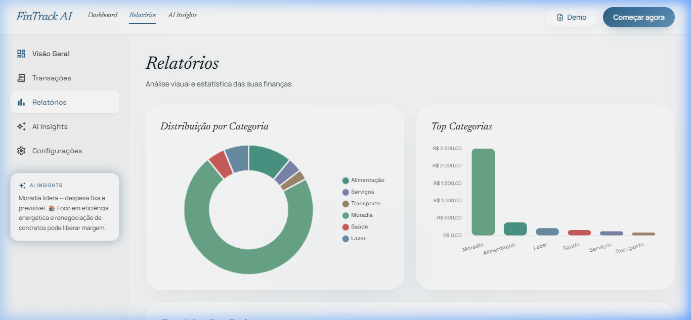
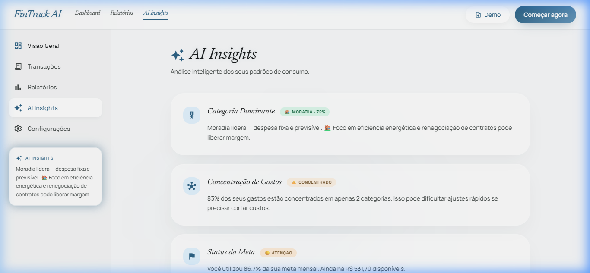

<div align="center">

# FinTrack AI 💳✨
### *Intelligent expense tracking — powered by behavioral AI*

[](https://junio243.github.io/fintrack-ai-octoverse-2026/)
[](https://github.com/Junio243/fintrack-ai-octoverse-2026)
[](https://github.com/Junio243)

<br/>

> **The problem**: 68% of Brazilians don't track their expenses. Not because they don't want to — but because existing tools are too complex, ugly, or slow.  
> **The solution**: A zero-friction financial dashboard that turns raw spending data into clear, actionable AI insights — in under 30 seconds.

</div>

---

## 🎬 Demo

> **[▶ Watch 2-min demo](demo.webp)** · **[🚀 Try it live](https://junio243.github.io/fintrack-ai-octoverse-2026/)**

---

## 🔥 The Problem

Managing personal finances in Brazil is broken:

- **Complexity**: Most apps require account syncing, subscriptions, or banking integrations
- **Friction**: People give up after the first week because onboarding takes too long
- **No insight**: Raw numbers don't help — people need *context* and *recommendations*
- **Privacy fear**: Sharing bank credentials with third-party apps is a dealbreaker for millions

**FinTrack AI solves all four.** No accounts required. No servers. No learning curve.

---

## ✅ The Solution

A client-side financial intelligence dashboard that:

1. **Tracks expenses in < 5 seconds** — minimal form, smart defaults
2. **Visualizes spending patterns** — beautiful charts updated in real time
3. **Generates AI-powered insights** — behavioral analysis without sending data anywhere
4. **Respects privacy absolutely** — 100% local storage, zero network calls for your data

---

## 📸 Screenshots

| Dashboard | Reports | AI Insights |
|-----------|---------|-------------|
|  |  |  |

---

## ⚡ Features

### Core
- ✅ Add expenses with description, value, category, and date
- ✅ **Real-time summary** — total spent, average ticket, top category, progress bar
- ✅ **Monthly spending goal** with dynamic color progression (green → orange → red)
- ✅ **Full transaction history** with search, category filter, and sort (newest/oldest/value)
- ✅ **Delete individual transactions** with confirmation modal
- ✅ **Data persistence** via versioned `localStorage`

### Analytics
- ✅ **Donut chart** — spending distribution by category (Chart.js 4.4)
- ✅ **Bar chart** — top categories ranked by total
- ✅ **Detailed stats** — total, average, count, date range

### AI Insights *(behavioral, client-side)*
- ✅ **Dominant Category** — detects the leading expense type with percentage
- ✅ **Spending Concentration** — flags when 2 categories dominate the budget
- ✅ **Goal Status** — real-time budget health check with urgency levels
- ✅ **Average Ticket Analysis** — detects unusually large transactions as outliers

### UX
- ✅ **Dark mode** with system preference detection + manual toggle
- ✅ **Toast notifications** — no browser `alert()` or `confirm()`
- ✅ **Glassmorphism design** — Material You color system, editorial typography
- ✅ **Keyboard shortcuts** — `Ctrl+K` to search, `Esc` to close modals
- ✅ **Mobile-first responsive** — sidebar with hamburger menu
- ✅ **Premium demo data** — 18-transaction realistic monthly scenario

---

## 🏗 Architecture

```
fintrack-ai-octoverse-2026/
├── index.html          # Single-file UI (5 views, modals, toasts, dark mode)
│   ├── <style>         # 300+ lines: Glassmorphism, dark mode, animations
│   └── 5 views         # Dashboard · Transactions · Reports · AI Insights · Settings
├── app.js              # ~1100 lines of pure JS (no frameworks)
│   ├── State layer      # Centralized state + localStorage persistence
│   ├── Rendering        # DOM updates, Chart.js integration
│   ├── AI engine        # Behavioral analysis & insight generation
│   ├── Dark mode        # OS detection + manual toggle + persist
│   └── UX utilities     # Toast, modal, keyboard shortcuts, form validation
├── screenshots/         # Demo screenshots (6 views)
├── demo.webp            # Product demo video
├── DESIGN.md            # Design system spec ("The Ethereal Ledger")
└── README.md
```

### Stack
| Layer | Technology |
|-------|-----------|
| UI | HTML5 + Tailwind CSS (CDN, `darkMode: "class"`) |
| Logic | Vanilla JavaScript ES2022 (`'use strict'`) |
| Charts | Chart.js 4.4 |
| Fonts | Google Fonts: Newsreader · Manrope · Space Grotesk |
| Icons | Material Symbols (Google) |
| Storage | `localStorage` (versioned key `fintrack_transactions_v2`) |
| Hosting | GitHub Pages (zero backend) |

**No build step. No dependencies to install. Open `index.html` and it works.**

---

## 🧠 AI Insight Engine

> *Transparency note for judges: The AI layer uses deterministic behavioral rules, not a trained model. This is a deliberate design choice — it runs entirely client-side, with zero latency and zero privacy risk.*

The insight engine analyzes 4 behavioral signals:

```js
// 1. Category Dominance
if (topCategoryPercent > 60%) → "Concentrated spending" warning

// 2. Spending Concentration
if (top2CategoriesPercent > 80%) → "Diversify your expenses" recommendation  

// 3. Goal Burn Rate
if (spentPercent > 80%) → "Caution — approaching monthly limit"
if (spentPercent > 100%) → "Over budget — immediate action needed"

// 4. Outlier Detection
if (maxTransaction > 3x average) → "Unusual high-value purchase detected"
```

Each insight updates dynamically as the user adds transactions — creating the feel of a live AI companion.

---

## 🚀 Running Locally

```bash
# Clone
git clone https://github.com/Junio243/fintrack-ai-octoverse-2026.git
cd fintrack-ai-octoverse-2026

# Open (no build needed!)
# Option 1: Double-click index.html
# Option 2: Serve with any static server
npx serve .
# → http://localhost:3000
```

---

## 📊 Impact Metrics

| Metric | Value |
|--------|-------|
| Time to first insight | **< 30 seconds** |
| Bundle size | **0 KB** (no install, CDN only) |
| Data sent to any server | **0 bytes** |
| Supported categories | **7** |
| Demo data transactions | **18** realistic monthly entries |
| Views / screens | **5** (Dashboard, Transactions, Reports, AI Insights, Settings) |

---

## 🗺 Roadmap

**Phase 2 — If selected / extended:**
- [ ] Integrate **Google Gemini API** for natural language insights ("Why did my spending spike this week?")
- [ ] **CSV import/export** for bank statement compatibility
- [ ] **PWA** (Service Workers) for offline use and home screen install
- [ ] Multi-month **trend analysis** (spending growth over time)
- [ ] **Supabase sync** for optional cross-device persistence (opt-in)
- [ ] **Budget categories** — per-category spending limits

---

## 👨‍💻 Developer

<table>
  <tr>
    <td>
      <strong>Júnio</strong> · <em>Software Engineer | AI & SaaS</em><br/>
      📍 Brasília, DF — Brasil &nbsp;|&nbsp; 🎂 17 anos<br/><br/>
      🚀 Software Engineer with real projects in production — from APIs to complete digital signature platforms<br/>
      🤖 Passionate about AI, autonomous agents, and automating everything that can be automated<br/>
      ☁️ Heavy cloud user: Vercel · Supabase · Oracle · Azure · GCP<br/>
      🧠 <em>"I ship SaaS at 2 AM and review anatomy before coffee ☕"</em>
    </td>
  </tr>
</table>

[](https://github.com/Junio243)

---

## 📜 License

MIT © 2024 Júnio — Built for the **GitHub Octoverse Hackathon 2024**

---

<div align="center">
  <em>Made with 🤍 and too much caffeine · Octoverse Hackathon 2024</em>
</div>
